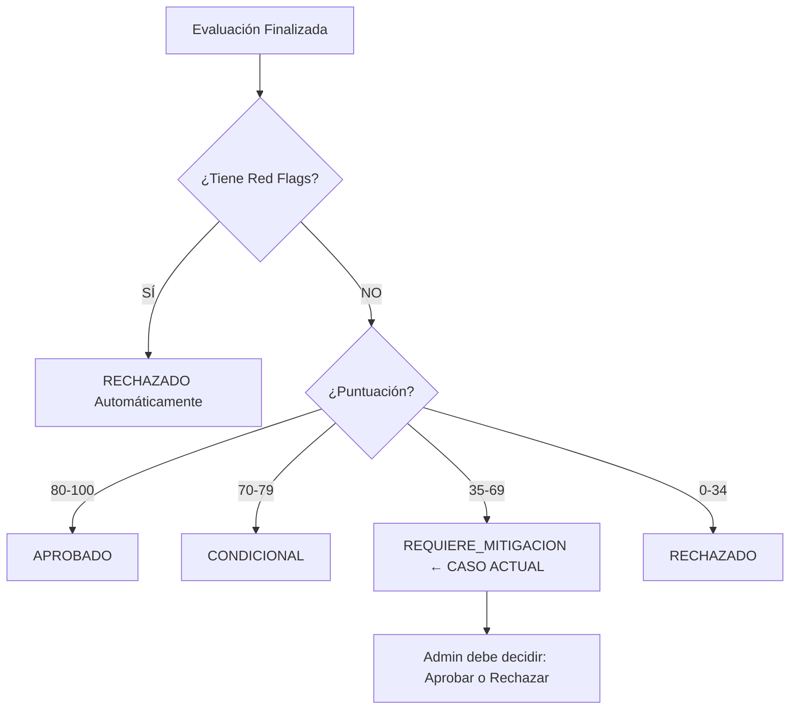

# 📊 ANÁLISIS DE RECHAZO/APROBACIÓN DE PRÉSTAMO

## 🎯 **RESULTADO DE LA EVALUACIÓN**

```
Puntuación Total:    40 / 100 puntos
Clasificación:       ALTO RIESGO
Decisión Final:      REQUIERE_MITIGACION
```

---

## ❌ **¿POR QUÉ SE RECHAZA O REQUIERE MITIGACIÓN?**

### 📍 **Reglas de Decisión (Según `prestamo_evaluacion_service.py` Líneas 241-264)**

| Puntuación | Decisión | Significado |
|---|---|---|
| **80-100** | 🟢 **APROBADO** | Riesgo bajo, tasa favorable |
| **70-79** | 🟡 **CONDICIONAL** | Requiere algunas garantías |
| **35-49** | 🟠 **REQUIERE_MITIGACION** | **← TU CASO (40 puntos)** |
| **0-34** | 🔴 **RECHAZADO** | Riesgo muy alto |
| **Cualquier + Red Flag** | 🔴 **RECHAZADO** | Señales de alerta |

---

## 🔍 **ANÁLISIS DE LA PUNTUACIÓN (40/100)**

### **Criterios Evaluados (Total: 100 puntos)**

| # | Criterio | Peso | Puntos Posibles | Puntos Obtenidos | Estado |
|---|---|---|---|---|---|
| 1 | Ratio Endeudamiento | 25% | 25 pts | ? | ❓ |
| 2 | Ratio Cobertura | 20% | 20 pts | ? | ❓ |
| 3 | Historial Crediticio | 20% | 20 pts | ? | ❓ |
| 4 | Estabilidad Laboral | 15% | 15 pts | ? | ❓ |
| 5 | Tipo de Empleo | 10% | 10 pts | ? | ❓ |
| 6 | Enganche/Garantías | 10% | 10 pts | ? | ❓ |
| **TOTAL** | | **100%** | **100** | **40** | ⚠️ **BAJO** |

---

## 📉 **CONDICIONES APLICADAS PARA RIESGO ALTO**

Según el servicio (`prestamo_evaluacion_service.py` línea 290-295):

```python
"ALTO": {
    "tasa_interes_aplicada": 18.0%,      # Tasa anual
    "plazo_maximo": 24 meses,            # 2 años máximo
    "enganche_minimo": 30.0%,            # Mínimo 30% de enganche
    "requisitos_adicionales": "Garante obligatorio"  # Necesita garante
}
```

### **Estas condiciones son REQUISITOS OBLIGATORIOS:**

1. ✅ **Tasa de Interés: 18%** (alta, refleja el riesgo)
2. ✅ **Plazo Máximo: 24 meses** (corto, reduce exposición)
3. ✅ **Enganche Mínimo: 30%** (reduce el monto financiado)
4. ✅ **Garante Obligatorio** (mitiga riesgo de incumplimiento)

---

## ⚠️ **SEÑALES DE ALERTA (Red Flags)**

### **¿Por qué NO está RECHAZADO directamente?**

En la imagen, **NINGUNA** de estas señales está marcada:

- ❌ Cédula Falsa
- ❌ Ingresos No Verificables
- ❌ Historial Malo
- ❌ Litigio Legal
- ❌ Más de Un Préstamo Activo

**Resultado:** No hay rechazo automático por red flags ✅

---

## 🎯 **JUSTIFICACIÓN DEL RECHAZO/CONDICIONES**

### **Con puntuación de 40/100:**

1. **Riesgo Alto (35-59 puntos):** El solicitante tiene un perfil de riesgo elevado
2. **Requiere Mitigación:** Se necesita un garante obligatorio
3. **Condiciones Estrictas:**
   - Tasa de 18% (más alta que la normal de 8%)
   - Plazo reducido a 24 meses
   - Enganche mínimo del 30%

### **¿Por qué estas condiciones?**

```
📊 RAZONAMIENTO:

→ Puntuación baja (40/100) = Múltiples riesgos
→ Tasa alta (18%) = Compensa el riesgo
→ Plazo corto (24 meses) = Menos exposición a incumplimiento
→ Enganche 30% = Solicitante invierte más, tiene "piel en el juego"
→ Garante = Protección adicional en caso de default
```

---

## 🔄 **FLUJO DE DECISIÓN**



---

## 📋 **PROCESO PARA EL ADMINISTRADOR**

### **Opciones Disponibles:**

1. **✅ APROBAR** con las condiciones estrictas:
   - Tasa 18%
   - Plazo 24 meses
   - Enganche 30%
   - Garante obligatorio

2. **❌ RECHAZAR** el préstamo:
   - Click en "Rechazar Préstamo"
   - Razón: Riesgo alto no mitigable

---

## 💡 **INTERPRETACIÓN DEL RESULTADO**

### **"REQUIERE_MITIGACION" significa:**

- ⚠️ El préstamo NO está completamente rechazado
- ⚠️ Puede aprobarse SI se cumplen condiciones estrictas
- ⚠️ El solicitante debe aceptar:
  - Tasa de interés más alta (18% vs 8% normal)
  - Plazo más corto (24 vs 36 meses)
  - Enganche más alto (30% vs 15%)
  - Buscar un garante

### **Ejemplo de Cálculo:**

Si el préstamo solicitado es de **$10,000**:

```
Enganche Requerido:      $3,000 (30%)
Monto Financiado:        $7,000
Tasa de Interés:         18% anual
Plazo:                   24 meses
Cuota Mensual:           ~$351
Total a Pagar:           ~$8,424
Interés Total:           ~$1,424
```

---

## 📝 **RESUMEN EJECUTIVO**

| Concepto | Valor | Explicación |
|---|---|---|
| **Puntuación** | 40/100 | Puntuación baja, múltiples riesgos |
| **Clasificación** | ALTO | Riesgo significativo |
| **Decisión Automática** | REQUIERE_MITIGACION | Requiere condiciones estrictas |
| **Decisión Admin** | PENDIENTE | Admin debe aprobar o rechazar |
| **Tasa Aplicada** | 18.0% | Alta, compensa riesgo |
| **Plazo Máximo** | 24 meses | Reducido |
| **Enganche** | 30% | Elevado |
| **Requisito** | Garante | Obligatorio |

---

## ✅ **ACCIÓN REQUERIDA**

El administrador debe:

1. **Revisar** los detalles individuales de cada criterio
2. **Decidir:** ¿Aprobar con condiciones estrictas o Rechazar?
3. **Si Aprobar:** Click en "Aprobar Préstamo"
4. **Si Rechazar:** Click en "Rechazar Préstamo"

---

## 🔧 **CORRECCIÓN DE ERROR**

### **Bug Corregido:**

**Antes (Línea 619-621):**
```typescript
(resultado.tasa_interes_aplicada * 100).toFixed(2) + '%'
// Resultado: 18.0 * 100 = 1800.00% ❌
```

**Ahora (Línea 620):**
```typescript
resultado.tasa_interes_aplicada.toFixed(2) + '%'
// Resultado: 18.0% ✅
```

**Explicación:** El backend ya almacena la tasa como porcentaje (18.0 = 18%), no como decimal (0.18).

---

## 📚 **REFERENCIAS**

- `backend/app/services/prestamo_evaluacion_service.py`
- `frontend/src/components/prestamos/EvaluacionRiesgoForm.tsx`
- `ESCALA_EVALUACION_PRESTAMOS.md`

