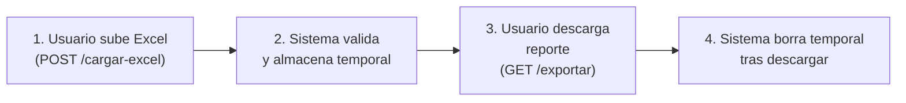

# 🔧 Guía de Integración: Reportes de Conciliación

## Problema Identificado
El sistema tenía **dos endpoints de conciliación incompatibles** que causaban confusión:
- Endpoint de Excel para marcar pagos como conciliados
- Endpoint JSON para datos temporales de reportes

**Resultado:** El frontend no podía integrar correctamente la carga de Excel en el reporte de conciliación.

---

## ✅ Solución Implementada

Se agregó un nuevo endpoint unificado que acepta Excel directamente:

### **POST `/api/v1/reportes/conciliacion/cargar-excel`** ⭐ NUEVO

**Propósito:** Carga datos de conciliación desde archivo Excel y los almacena en tabla temporal

**Formato esperado del Excel:**
| Columna A | Columna B | Columna C | Columna D | Columna E | Columna F |
|-----------|----------|----------|----------|----------|----------|
| Cédula | Total Financiamiento | Total Abonos | (ignore) | Dato Extra 1 | Dato Extra 2 |
| V12345678 | 10000.00 | 5000.00 | | Info1 | Info2 |
| E98765432 | 15000.00 | 7500.00 | | Info1 | Info2 |

**Validaciones:**
- ✅ Cédula: formato válido (5-20 caracteres alfanuméricos o guiones)
- ✅ Total Financiamiento: número ≥ 0
- ✅ Total Abonos: número ≥ 0
- ✅ Columnas E y F: opcionales

**Respuesta Exitosa:**
```json
{
  "ok": true,
  "mensaje": "Carga exitosa: 150 filas procesadas",
  "filas_ok": 150,
  "filas_con_error": 0,
  "errores": []
}
```

**Respuesta con Errores:**
```json
{
  "ok": false,
  "mensaje": "Se encontraron 3 errores de validación",
  "errores": [
    "Fila 5: cédula inválida (12345)",
    "Fila 12: total financiamiento debe ser un número ≥ 0",
    "Fila 18: total abonos debe ser un número ≥ 0"
  ],
  "filas_ok": 0,
  "filas_con_error": 3
}
```

---

## Endpoints Disponibles (Después de la Solución)

### 1. **POST `/api/v1/reportes/conciliacion/cargar-excel`** ⭐ RECOMENDADO
- **Entrada:** Archivo Excel (.xlsx o .xls)
- **Funcionalidad:** Carga datos de cédulas, montos, datos extras
- **Almacenamiento:** Tabla temporal `conciliacion_temporal`
- **Uso:** Frontend carga directamente desde formulario con drag-drop

### 2. **POST `/api/v1/reportes/conciliacion/cargar`** (Alternativa JSON)
- **Entrada:** JSON array `[{cedula, total_financiamiento, total_abonos, ...}]`
- **Funcionalidad:** Misma que arriba pero entrada manual JSON
- **Uso:** Si el frontend quiere procesar Excel con JavaScript primero

### 3. **GET `/api/v1/reportes/exportar/conciliacion`**
- **Parámetros:** 
  - `formato`: "excel" o "pdf"
  - `fecha_inicio`: YYYY-MM-DD (opcional)
  - `fecha_fin`: YYYY-MM-DD (opcional)
  - `cedulas`: cédulas separadas por coma (opcional)
- **Funcionalidad:** Genera reporte con datos de `conciliacion_temporal`
- **Nota:** Al descargar Excel se borran los datos temporales automáticamente

### 4. **GET `/api/v1/reportes/conciliacion/resumen`**
- **Parámetros:** 
  - `fecha_inicio`: YYYY-MM-DD (opcional)
  - `fecha_fin`: YYYY-MM-DD (opcional)
- **Funcionalidad:** Obtiene resumen sin generar archivo

### 5. **POST `/api/v1/pagos/conciliacion/upload`** (Diferente)
- **Entrada:** Excel con `[Fecha Depósito | Número Documento]`
- **Funcionalidad:** Marca pagos existentes como conciliados
- **Nota:** DIFERENTE al flujo de reportes - esto es para pagos bancarios

---

## 🔄 Flujo de Uso Correcto

### Opción A: Cargar Excel → Generar Reporte


### Opción B: Entrada Manual JSON → Generar Reporte


---

## 💻 Ejemplos de Implementación Frontend

### React - Carga con Formulario
```tsx
const [file, setFile] = useState<File | null>(null);

const handleUpload = async () => {
  if (!file) return;
  
  const formData = new FormData();
  formData.append('file', file);
  
  try {
    const response = await fetch('/api/v1/reportes/conciliacion/cargar-excel', {
      method: 'POST',
      body: formData,
    });
    
    const result = await response.json();
    if (result.ok) {
      // Éxito - mostrar mensaje
      toast.success(`${result.filas_ok} filas cargadas`);
      // Aquí puede descargar el reporte
    } else {
      // Error de validación
      toast.error(result.mensaje);
      console.table(result.errores);
    }
  } catch (error) {
    toast.error('Error al cargar archivo');
  }
};

return (
  <div>
    <input 
      type="file" 
      accept=".xlsx,.xls"
      onChange={(e) => setFile(e.target.files?.[0] || null)}
    />
    <button onClick={handleUpload}>Cargar Conciliación</button>
  </div>
);
```

### Vue - Componente Upload
```vue
<template>
  <div class="upload-container">
    <input 
      type="file" 
      ref="fileInput"
      accept=".xlsx,.xls"
      @change="onFileSelected"
    />
    <button @click="uploadFile">Cargar</button>
  </div>
</template>

<script>
export default {
  methods: {
    async uploadFile() {
      const formData = new FormData();
      formData.append('file', this.$refs.fileInput.files[0]);
      
      const response = await fetch('/api/v1/reportes/conciliacion/cargar-excel', {
        method: 'POST',
        body: formData,
      });
      
      const result = await response.json();
      this.$notify({
        title: result.ok ? 'Éxito' : 'Error',
        message: result.mensaje,
      });
    },
  },
};
</script>
```

---

## 🐛 Troubleshooting

| Problema | Causa | Solución |
|----------|-------|----------|
| **"Debe subir un archivo Excel (.xlsx o .xls)"** | Archivo en formato incorrecto | Usar .xlsx o .xls |
| **"Archivo Excel vacío"** | No hay data en Excel | Agregar datos desde fila 2 |
| **"cédula inválida"** | Formato no reconocido | Cédula 5-20 caracteres (V, E, J, etc.) |
| **"total financiamiento debe ser un número ≥ 0"** | Formato incorrecto | Usar números sin caracteres especiales |
| **404 endpoint not found** | Ruta incorrecta | Verificar `/reportes/conciliacion/cargar-excel` |
| **500 Internal Server Error** | Error al procesar Excel | Revisar logs: `openpyxl`, encoding UTF-8 |

---

## 📝 Cambios Realizados

1. ✅ Agregado endpoint `/reportes/conciliacion/cargar-excel`
2. ✅ Agregado import de `File` en reportes_conciliacion.py
3. ✅ Validación de cédula y montos desde Excel
4. ✅ Documentación de flujo correcto
5. ✅ Sincronización con tabla `conciliacion_temporal`

---

## 🚀 Próximos Pasos

1. **Frontend:** Actualizar componente para usar `/reportes/conciliacion/cargar-excel`
2. **Tests:** Crear casos de prueba con Excel válido/inválido
3. **Documentación:** Agregar ejemplo de Excel en repo
4. **Logs:** Monitorear errores de carga en Render

---

## 📞 Soporte

Si el upload aún no integra correctamente:
1. Verificar que el Excel tiene datos desde fila 2
2. Revisar que las cédulas tengan prefijo (V, E, J, etc.)
3. Verificar encoding del archivo (UTF-8)
4. Revisar logs de Render para mensajes de error específicos
